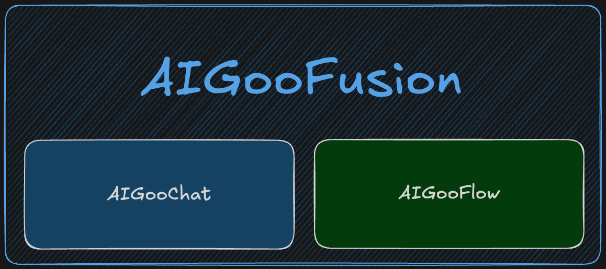

<div align="center">

  <a href=""></a>
  <a href=""></a>

</div>

# AIGooFusion



`AIGooFusion` is a framework for developing applications powered by large language models (LLMs). `AIGooFusion` has `AIGooChat` and `AIGooFlow`. 
- `AIGooChat` is llm abstraction to use various llm on one module. 
- `AIGooFlow` is llm apps workflow.
## Example
### AIGooChat Example
```python
info="""
Irufano adalah seorang sofware engineer.
Dia berasal dari Indonesia.
""" 

def test_chat():
    # Configuration
    config = OpenAIConfig(
        temperature=0.7
    )

    # Initialize llm
    llm = OpenAIModel(model="gpt-4o-mini", config=config)
    
    SYSTEM_PROMPT = """Answer any user questions based solely on the data below:
    <data>
    {info}
    </data>
    
    DO NOT response outside context."""

    # Initialize framework
    framework = AIGooChat(llm, system_message=SYSTEM_PROMPT, input_variables=["info"])
    
    try:
        # Example conversation with tool use
        messages = [
            Message(role=Role.USER, content="apa ibukota indonesia?")
        ]
        with openai_usage_tracker() as usage:
            response = framework.generate(messages, info=info)
            print(f"\n>> {response.result.content}\n")
            print(f"\nUsage:\n{usage}\n")
        
    except AIGooException as e:
        print(f"{e}")

test_chat()
```


### AIGooFlow Example

```python
async def test_flow():
    # Configuration
    config = OpenAIConfig(
        temperature=0.7
    )

    llm = OpenAIModel("gpt-4o-mini", config)

    # Define a sample tool
    @Tool()
    def get_current_weather(location: str, unit: str = "celsius") -> str:
        return f"The weather in {location} is 22 degrees {unit}"

    @Tool()
    def get_current_time(location: str) -> str:
        # Initialize framework
        aig = AIGooChat(llm, system_message="You are a helpful assistant.")

        # Example conversation with tool use
        time = f"The time in {location} is 09:00 AM"
        msgs = [
            Message(role=Role.USER, content=time),
        ]
        res = aig.generate(msgs)
        return res.result.content or "No data"

    tool_list = [get_current_weather, get_current_time]

    # Initialize framework
    fmk = AIGooChat(llm, system_message="You are a helpful assistant.")

    # Register tool
    fmk.register_tool(tool_list)

    # Register to ToolRegistry
    tl_registry = ToolRegistry(tool_list)

    # Workflow
    workflow = AIGooFlow({
        "messages": [],
    })

    # Define Node functions
    async def main_agent(state: WorkflowState) -> dict:
        messages = state.get("messages", [])
        response = fmk.generate(messages)
        messages.append(response.process[-1])
        return {"messages": messages, "system": response.process[0]}

    async def tools(state: WorkflowState) -> dict:
        messages = tools_node(messages=state.get("messages", []), registry=tl_registry)
        return {"messages": messages}

    def should_continue(state: WorkflowState) -> str:
        messages = state.get("messages", [])
        last_message = messages[-1]
        if last_message.tool_calls:
            return "tools"
        return END


    # Add nodes
    workflow.add_node("main_agent", main_agent)
    workflow.add_node("tools", tools)

    # Add edges structure
    workflow.add_edge(START, "main_agent")
    workflow.add_conditional_edge("main_agent", ["tools", END], should_continue)
    workflow.add_edge("tools", "main_agent")

    async def call_sql_agent(question: str):
        try:
            with openai_usage_tracker() as usage:
                res = await workflow.execute({
                    "messages": [
                        Message(role=Role.USER, content=question)
                    ]
                })

            return res, usage
        except Exception as e:
            raise e


    quest="What's the weather like in London and what time is it?"
    res, usage = await call_sql_agent(quest)
    print(f"---\nResponse content:\n")
    print(res['messages'][-1].content)
    print(f"---\nRaw usages:")
    for usg in usage.raw_usages:
        print(f"{usg}")
    print(f"---\nCallback:\n {usage}")

async def run():
	# await test_workflow()
	await test_flow()

asyncio.run(run())

```

## Develop as Contributor
### Build the container
```sh
docker-compose build
```

### Run the container
```sh
docker-compose up -d aigoo-fusion
```

### Stop the container
```sh
docker-compose stop aigoo-fusion
```

### Access the container shell
```sh
docker exec -it aigoo_fusion bash
```

### Run test
```sh
python aigoo_fusion/test/test_chat.py 
python aigoo_fusion/test/test_flow.py 
```
or
```sh
python aigoo_fusion.test.test_chat.py 
python aigoo_fusion.test.test_flow.py 
```